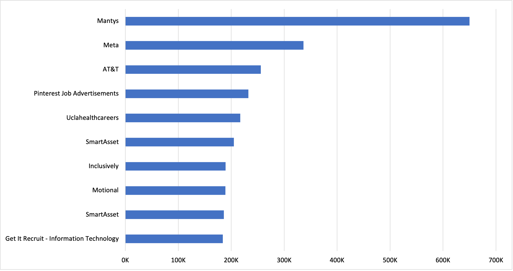
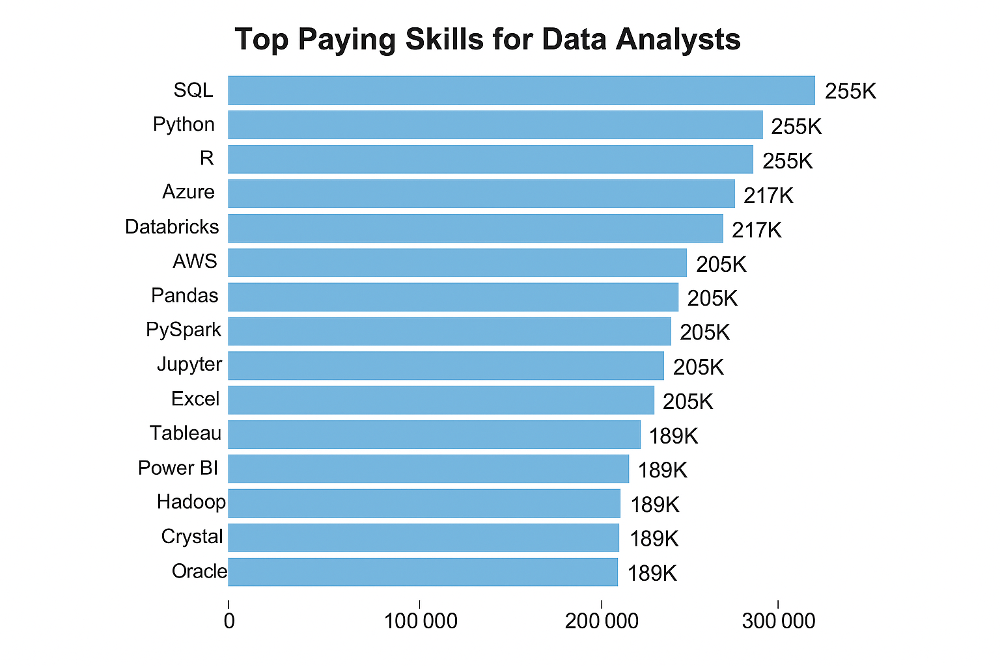
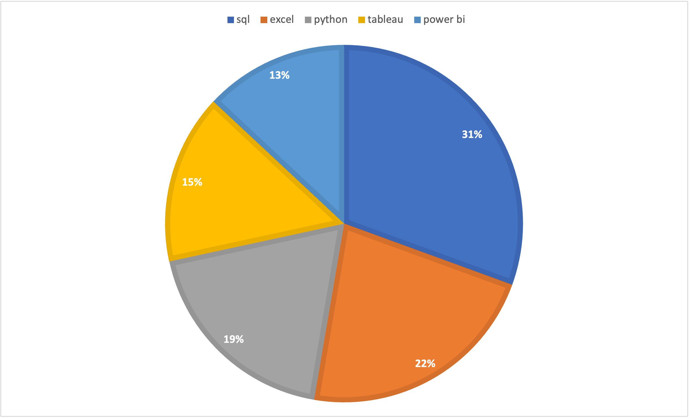
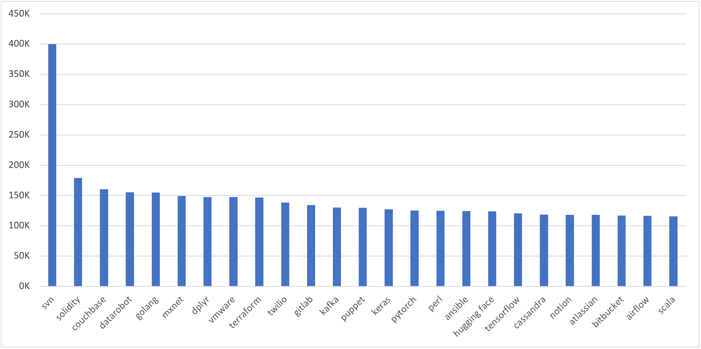
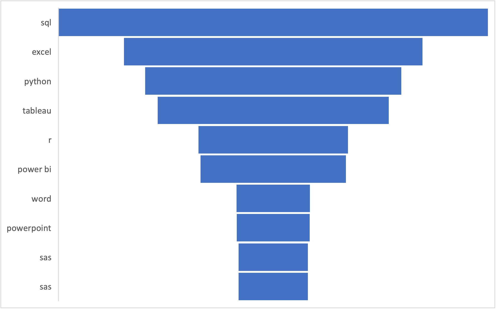

## Introduction

This project focuses on analyzing job posting data related to **Data Analyst roles**.  
By using **SQL (PostgreSQL)** as the primary tool for querying and data exploration, the project aims to uncover trends in salaries, hiring companies, job locations, and the skills most in demand.  
The purpose of this analysis is to translate raw job data into valuable insights that reflect the current state of the Data Analytics job market.  
It serves as both a learning exercise in SQL and a practical exploration of how structured query language can reveal patterns in real-world employment data.

### Check out the SQL Queries here: [project_sql folder](/Project/)  

## Background

The dataset used in this project comes from the [SQL Course](https://www.youtube.com/watch?v=7mz73uXD9DA)

It includes multiple dimensions such as:
- **Company details** – information about the employer and hiring organization  
- **Job titles and roles** – description and categorization of each position  
- **Location types** – remote, hybrid, and on-site job opportunities  
- **Salary information** – annual average salary data where available  
- **Posting details** – job posting date, schedule type, and other attributes  

The goal of analyzing this dataset is to understand the **factors that influence salaries, hiring patterns, and demand for analytical skills**.  
This project reflects how data-driven insights can help professionals and students identify valuable trends in the growing Data Analytics job market.

### The questions I wanted to answer through my
SQL queries were:
1. What are the top-paying data analyst jobs?
2. What skills are required for these top-paying jobs?
3. What skills are most in demand for data
analysts?
4. Which
skills are associated with higher
salaries?
5. What
are the most optimal skills to learn?

## Tools Used

- **PostgreSQL** – used for executing SQL queries, data exploration, and analysis  
- **Visual Studio Code** – the main editor for writing and managing SQL scripts  
- **Git & GitHub** – for version control, tracking changes, and sharing the project  
- **Excel / CSV Files** – used as data sources imported into PostgreSQL for analysis  

These tools together provided a complete workflow for performing data analysis — from raw data extraction to structured insights and documentation.

# Analysis
## 1. Top Paying Jobs
To identify top paying job roles, I filtered Data Analyst positions by yearly average salary and job location, focusing on remote jobs, this query highlights top paying jobs in the field.

### Key Insights
- **Wide Salary Range** : Top 10 Data Analyst job roles have salaries ranging all the way from **$184K** to **$650K**, indicating significant salary potential in the field.
- **Diverse Employers** : Companies like **Mantys**, **Meta**, **AT&T**, etc. are those offering high salaries, showing a broad interest in this field.
- **Job Title Variety** : There is a variety of job titles in this field, ranging from **Data Analyst** to **Associate Director - Data Insights**, indicating various specializations within the role.

The chart below visualizes the **Top 10 Highest Paying Data Analyst Jobs**.  
It provides a quick comparison of salary ranges across companies for remote roles.

## 2. Skills required for Top Paying Jobs
After identifying the highest-paying Data Analyst jobs, I focused on understanding which **skills** were most commonly associated with those roles.  
The goal was to discover what technical expertise employers value most when offering higher compensation.

### Key Insights
- **SQL** and **Python** consistently appear among the highest-paying roles, confirming their dominance in the analytics space.  
- Advanced tools like **Snowflake**, **Azure**, and **Tableau** are highly valued by companies offering six-figure salaries.  
- Employers paying top salaries tend to prefer candidates with **data engineering and cloud-related skills**, not just data analysis expertise.  
- Skills associated with **data visualization** and **database management** also correlate strongly with higher pay.

The chart below visualizes the **Top Skills Associated with the Highest Paying Jobs** in Data Analytics.

## 3. High Demand Skills
In this section, I analyzed which **skills are most frequently required** in Data Analyst job postings, regardless of salary.  
The purpose was to identify the technical competencies that are currently in **highest demand** across the industry.
### Key Insights
- **SQL** is the most universally required skill, appearing in the majority of Data Analyst job postings.  
- **Excel** remains highly relevant, reflecting its continuing importance for quick data manipulation and reporting.  
- **Python** and **Tableau** are increasingly dominant, signaling the shift toward programmatic analysis and data visualization.  
- **Power BI**, **R**, and **SAS** appear in more specialized analytics roles, showing a trend toward data integration and advanced statistical modeling.  
- Employers prioritize **core analytical and visualization skills** over niche or emerging tools.

The chart below visualizes the **Top 5 Most In-Demand Skills for Data Analysts**, providing a clear picture of where aspiring analysts should focus their learning efforts.

These findings highlight that while advanced tools offer an edge, mastering the foundational trio — **SQL, Excel, and Python** — is essential for success in the analytics job market.

## 4. Top Paying Skills
This section explores which **skills lead to higher salaries** for Data Analysts.  
Rather than just looking at demand, the focus here is on identifying which specific technical competencies are associated with **above-average compensation**.

### Key Insights
- **Big Data and Cloud Tools** such as **Snowflake**, **Azure**, and **AWS** rank among the top-paying skills.  
- **Programming Languages** like **Python** and **R** remain valuable for both analytics and advanced modeling tasks.  
- **Database and Query Tools** like **SQL** continue to serve as a baseline skill — essential for any analyst role.  
- Companies rewarding higher pay often seek professionals comfortable with **data warehousing, pipeline management, and automation**.  

The chart below shows the **Top 10 Highest Paying Skills** for Data Analysts, providing a visual representation of how technical expertise influences earning potential.

In conclusion, while foundational skills such as SQL and Python are mandatory, developing proficiency in cloud technologies and advanced analytics tools significantly boosts salary prospects in the field of Data Analytics.

## 5. Most Optimal Skills
After analyzing both **high-demand** and **high-paying** skills, this section focuses on identifying which skills strike the **best balance between demand and salary**.  
These are the “sweet spot” skills that maximize employability while also providing strong compensation opportunities.

### Key Insights
- **SQL**, **Python**, and **Tableau** appear in the overlap between high-demand and high-paying skills, confirming their importance as foundational tools.  
- **R** and **Power BI** provide strong salary potential for analysts looking to specialize in statistics and visualization.  
- Skills related to **cloud platforms** (such as **Snowflake** and **Azure**) add a significant competitive advantage in the job market.  
- The most optimal strategy for aspiring Data Analysts is to **master core analytics tools first**, then branch into **cloud and visualization technologies**.

The chart below displays the **Most Optimal Skills for Data Analysts**, combining demand and salary insights into one visual reference.

In summary, the analysis reveals that focusing on a blend of **core analytical**, **visualization**, and **cloud-based** skills creates the strongest career advantage in the modern data landscape.

## What I Learned

Working on this project significantly improved my understanding of **SQL**, **data analysis**, and **career trends** within the Data Analytics field.  
It provided hands-on experience with real-world datasets and helped reinforce both technical and analytical thinking skills.

### Key Learnings
- Developed confidence in writing **advanced SQL queries** using joins, filters, aggregations, and subqueries.  
- Learned to extract **meaningful business insights** from raw job posting data.  
- Strengthened understanding of **data modeling** and relationships between fact and dimension tables.  
- Gained experience in **analyzing salary trends** and identifying skill-based compensation patterns.  
- Understood the importance of combining **technical and visualization skills** for professional growth.  
- Practiced **version control** with Git and GitHub, maintaining a structured and clean project workflow.  

This project not only enhanced my technical skill set but also improved my ability to interpret and communicate data-driven insights effectively.

## Conclusion

This project provided valuable insights into the **Data Analytics job market** by examining salary trends, in-demand skills, and optimal skill combinations using SQL.  
Through systematic analysis of job posting data, it became clear how different technical skills influence both employability and compensation.

### Key Takeaways
- **SQL, Python, and Tableau** stand out as the most valuable skills, balancing both high demand and strong salary potential.  
- **Cloud technologies** like **Snowflake**, **Azure**, and **AWS** are emerging as differentiators for top-paying analytics roles.  
- The job market continues to reward professionals who combine **data analysis, visualization, and engineering skills**.  
- Structured SQL analysis remains a powerful and accessible method for uncovering job market insights without relying on complex tools.

### Final Thoughts
This project not only deepened my understanding of SQL and database management but also demonstrated the practical application of data analytics in real-world career research.  
It highlights how well-structured data analysis can empower individuals to make informed career decisions in a data-driven world.
